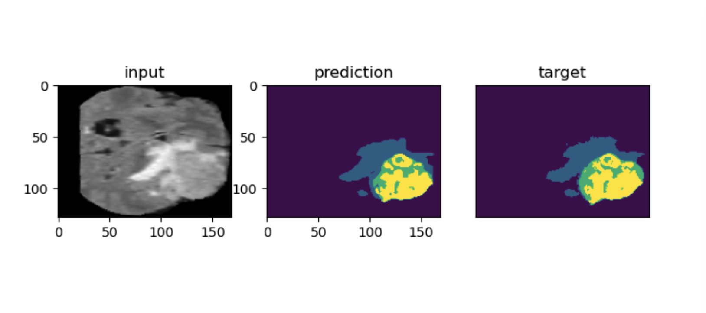

<div align="center">

# Evaluation of the impact of data preprocessing on the quality of segmentation models based on transformers
<a href="https://pytorch.org/get-started/locally/"></a>


</div>

## Description

This project focuses on evaluating the impact of low and high frequency distortion as data preprocessing techniques on the quality of segmentation models based on transformers, specifically for brain tumor segmentation. The study compares the performance of UNet with 3D convolutions, UNetR, and VIT with 3D patches, and finds that UNetR is the most stable model against distortions of different frequencies. 

## Installation and environment

#### Pip

```bash
# clone project
git clone https://github.com/JJBT/brain-segmentation.git
cd brain-segmentation

# [OPTIONAL] Create conda environment
conda create -n brain-segmentation
conda activate brain-segmentation

# install requirements
pip install -r requirements.txt
```

## Dataset
The dataset (Multimodal Brain Tumor Segmentation Challenge 2020) for this project can be downloaded from the following page: [link](https://www.med.upenn.edu/cbica/brats2020/data.html).

## Training

```bash
python3 train.py --config <path to config (in 'configs' folder)> --debug <True for sanity checker, default False>
```

## Evaluating
```bash
python3 validate.py --model_config <path> --data_config <path> --title <output folder name> --path_to_checkpoint <path, None for using from 'model_config', default None>
```


